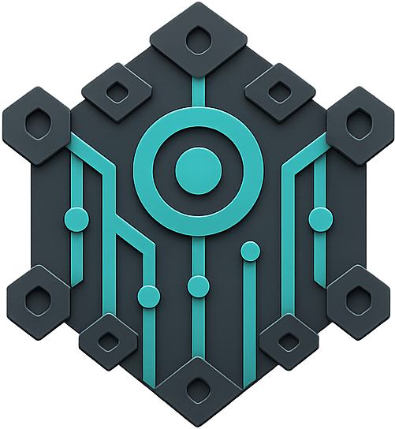
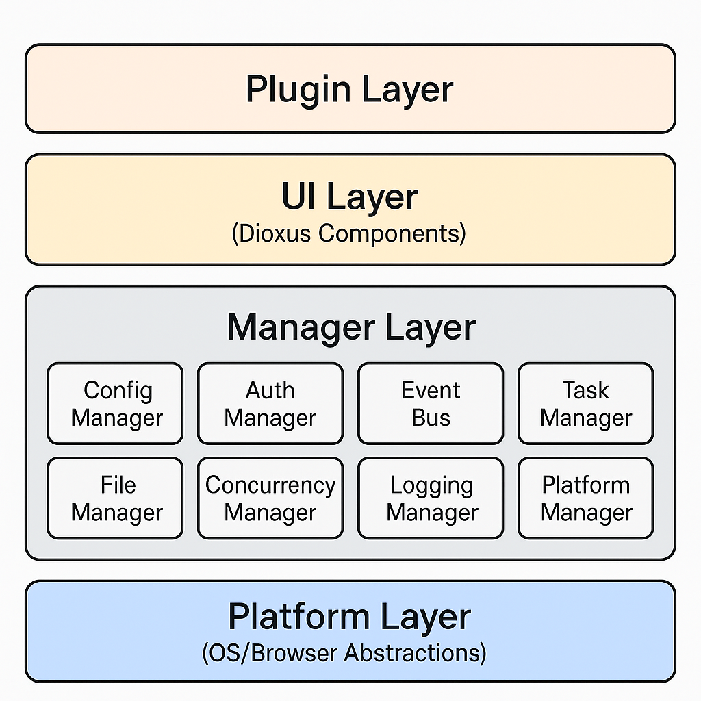

# Qorzen Oxide

<div align="center">



**A high-performance, modular plugin-based application framework built in Rust**

[](https://www.rust-lang.org)
[](LICENSE)
[](https://github.com/sssolid/QorzenOxide/actions/workflows/ci.yml)
[](https://docs.rs/qorzen_oxide)
[](https://crates.io/crates/qorzen_oxide)
[](https://crates.io/crates/qorzen_oxide)

[🌐 Website](https://www.qorzen.com) • [📚 Documentation](https://docs.qorzen.com) • [💬 Discord](https://discord.gg/qorzenhq) • [🐦 Twitter](https://twitter.com/qorzenhq) • [📄 GitHub Pages (mirror)](https://sssolid.github.io/QorzenOxide/)

</div>

## ✨ Overview

Qorzen Oxide is a next-generation application framework that combines the performance of Rust with the flexibility of a plugin-based architecture. Built with modern async patterns and comprehensive type safety, it enables developers to create scalable, cross-platform applications with ease.

### 🎯 Key Features

- **🚀 Cross-Platform**: Deploy seamlessly on Desktop (Windows, macOS, Linux), Mobile (iOS, Android), and Web (WebAssembly)
- **🧩 Plugin Architecture**: Extensible system with dependency management
- **⚡ Async-First**: Built on Tokio with comprehensive async managers and type-safe concurrency
- **🎨 Modern UI**: Powered by Dioxus for reactive, component-based user interfaces
- **🔐 Security-First**: Built-in authentication, authorization, and security policies
- **📊 Observability**: Comprehensive logging, metrics, and health monitoring
- **⚙️ Configuration**: Tiered configuration system with hot-reloading and validation
- **🗃️ Data Management**: Integrated file, database, and storage abstractions

### 🌟 Why Qorzen Oxide?

| Feature | Traditional Frameworks | Qorzen Oxide |
|---------|----------------------|--------------|
| **Performance** | Interpreted/JIT | Native Rust compilation |
| **Memory Safety** | Runtime errors | Compile-time guarantees |
| **Concurrency** | Thread pools/callbacks | Async/await with structured concurrency |
| **Plugin System** | Basic loading | Hot-reload, dependency resolution, sandboxing |
| **Cross-Platform** | Multiple codebases | Single Rust codebase |
| **Type Safety** | Runtime type checking | Compile-time type system |

## 🚀 Quick Start

### Prerequisites

- **Rust 1.70+** - [Install Rust](https://rustup.rs/)
- **Git** - For cloning the repository

### Installation

#### Option 1: From Crates.io
```bash
cargo install qorzen_oxide
```

#### Option 2: From Source
```bash
git clone https://github.com/sssolid/QorzenOxide.git
cd QorzenOxide
cargo build --release
```

#### Option 3: Using Docker
```bash
docker pull qorzen/oxide:latest
docker run -p 8080:8080 qorzen/oxide:latest
```

### Platform-Specific Setup

#### Desktop Application
```bash
cargo run --features desktop --bin qorzen_desktop
```

#### Web Application (WASM)
```bash
# Install trunk for WASM builds
cargo install trunk
trunk serve
```

#### Development Mode
```bash
cargo run -- dev --port 8080
```

## 🏗️ Architecture

Qorzen Oxide follows a modular architecture with well-defined separation of concerns:



### Core Managers

- **Configuration Manager**: Tiered configuration with hot-reloading
- **Authentication Manager**: Secure user management and session handling
- **Event Bus**: High-performance pub/sub messaging system
- **Task Manager**: Async task scheduling and execution
- **File Manager**: Cross-platform file operations with watching
- **Plugin Manager**: Loading and lifecycle management
- **Platform Manager**: OS/browser abstraction layer

## 🔧 Configuration

Qorzen Oxide uses a flexible tiered configuration system:

```
System Config → Global Config → User Config → Local Config → Runtime Config
    (lowest priority)                                    (highest priority)
```

Configuration files support YAML, JSON, and TOML formats with automatic format detection.

## 🧩 Plugin Development

Create powerful plugins with the Qorzen Plugin API:

- **Dependency Management**: Automatic resolution and loading
- **Sandboxed Execution**: Safe plugin isolation
- **UI Integration**: Seamless component integration
- **Event System**: React to system and user events

## 📱 Supported Platforms

| Platform | Status | Features |
|----------|--------|----------|
| **Windows** | ✅ Full Support | Native UI, File System, Notifications |
| **macOS** | ✅ Full Support | Native UI, File 
